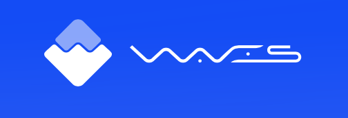
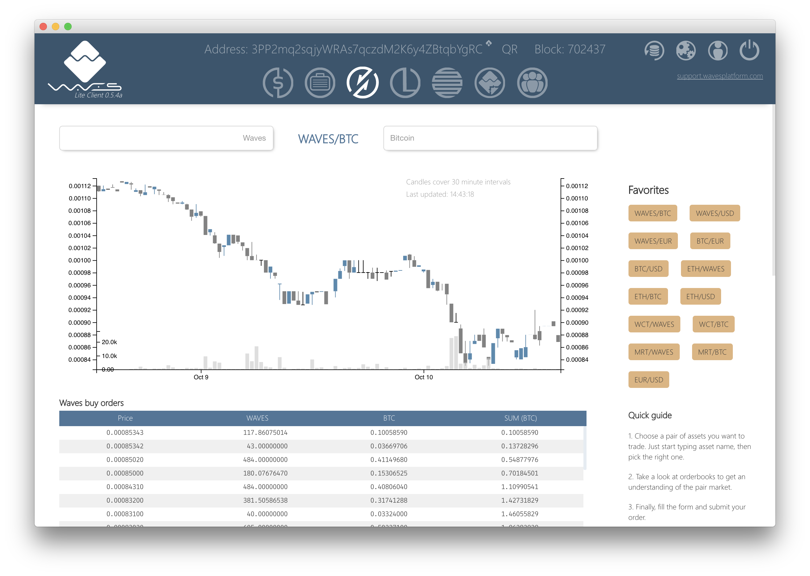

### BeerBash
### 2017/10/10
### Waves Platform
### Shinohara Wataru

---

### 私

- ビッグデータ部
- レコメンドチーム
  - Kubernetes
  - Spinnaker
  - Istio
- 最近はずっとブロックチェーン

---

<!-- .element height="60%" width="60%" -->

---

### Waves Platform

- 2016年にICOで1600万ドル調達
- Scalaで書かれた独自のブロックチェーン
- カスタムアプリケーショントークン
  - MobileGo
- Wavesが運営
- 分散取引所(DEX)
  - Waves以外で発行したトークンも取引可能
  - BTC, ETHも取引可能
  - 法定通貨(USD, EURO)も取引可能
- リース

---

### ICOとは

- Initial Coin Offering
- トークンを発行してお金を集める方法
- 資金集め
- 価値が上がる前に手に入れられる
- 詐欺も（たくさん）ある

---

### カスタムアプリケーショントークン

- 独自トークン（通貨）
- 5分で作れる
- バーガーキング（ロシア）のトークン
- 前述のICOにも使えます

---

### 取引所とは

- 売りたい人と買いたい人のマッチングサービス
- bitFlyer, coincheck, 東証、大証

---

### 中央集権型と分散型の違い

- コントロールする人や組織がいない
- 国とか銀行とか会社とか

---

### 分散取引所のメリット

- 取引の実行をブロックチェーンで実行
- 取引所に入金する必要がない
- 出金の手間や制限がない
- 横領がない
- ハッキングのリスクが少ない
- サーバーダウンのリスクが少ない

---

### 分散取引所のデメリット

- 手厚いサポートはない
- 法定通貨との取引が難しい

---

### Wavesの分散取引所

<!-- .element height="60%" width="60%" -->

---

### Wavesの分散取引所

#### Waves以外で発行したトークン(BTCの場合)

- 1BTCをデポジット
- 1WBTCというペッグ通貨をもらえる
- WBTCを使って取引する
- WBTCを返したらBTCが返却される

---

### Wavesの分散取引所

#### 法定通貨の場合(USD)

- 顧客確認 
  - https://www.idnow.eu

---

### リース

- 持ってるwavesを貸し出す
- お返しに色々なトークンがもらえる
- 価値がいきなりついてたりする 

---

### こんな人におすすめ

- コインを作ってみたい人
- いろんなトークンを持ってたい人
- ICOに興味がある人
- 新しいものを追っかけて行きたい人 